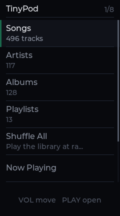
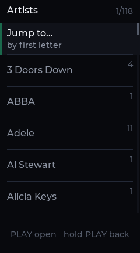
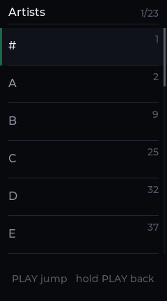
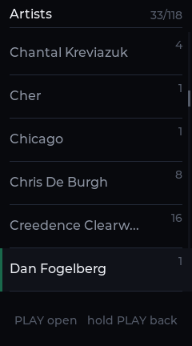
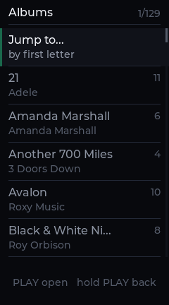
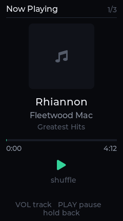
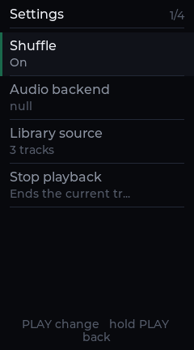
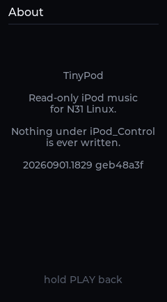

# TinyPod

A read-only music player for the iPod nano 7th generation, running under N31
Linux.

TinyPod plays the library that is already on the iPod — the one iTunes wrote.
It does not sync, does not build a database of its own, and never writes a byte
under `iPod_Control`. Mount the volume and it finds the music.

## Screens

|  |  |  |
|:--:|:--:|:--:|
|  |  |  |
| Home | Artists | Jump to a letter |
|  |  |  |
| Landed under D | Albums | Inside an album |
|  |  |  |
| Now Playing | Settings | About, and which build this is |

The browsing screens come off a real 496-track library; the last three off the
three-song test fixture, which is why they look so quiet. Every one of them is
rendered by `tinypod gui-shots`, which drives the same view and key-handling
code the device runs — see [Screenshots](#screenshots).

## Reading the library

A nano 7G keeps its library in SQLite, and TinyPod reads it where it lies:

- **`iTunes Library.itlp/`** — `Library.itdb` (SQLite, `user_version 25`) holds
  the tracks, artists, albums and playlists; `Locations.itdb` holds where each
  file actually is. Locations are relative to `iPod_Control/Music` and look
  like `F13/QRLF.mp3`, with the extension repeated as a FourCC.
- **`iTunesCDB` / `iTunesDB`** — the older `mhbd` binary databases, for a device
  synced by something that wrote those instead.
- **A walk of `Music/F00`…`F49`**, reading tags out of the files themselves.
  This needs no database at all, which is the point of it: it is what is left
  when the rest is gone.

Each is tried in turn and the first that yields tracks wins. A track whose file
has gone missing is counted and named, not fatal — one bad row must not cost
you the library:

```sh
tinypod libcheck        # which database was read, and what it can and cannot play
```

## Playing

AAC (including HE-AAC/SBR), MP3 and WAV decode inside the process, through the
Helix decoders and an MP4/M4A demuxer written for this, so `.m4a` files play
exactly as iTunes left them. There is no helper process and no temporary file.
That is not an optimisation: the N31 initramfs contains no media player to
shell out to.

`FFMPEG=1` adds an audio-only libavcodec/libavformat for everything else —
FLAC, Vorbis, Opus, ALAC, WMA, APE, WavPack, Musepack, TTA, AC3, DTS and the
rest of the list. See [Wide format support](#wide-format-support).

Audio leaves through one of three backends: `alsa` on the device (tinyalsa,
falling back to OSS `/dev/dsp`), `external` on a development host (mpv, ffplay,
mplayer, cvlc or mpg123, whichever is installed), and `null`, which resolves
and decodes without playing.

## Three buttons

The device has three usable buttons, so every interaction is move, open, or
hold to go back. The UI is shaped by that and not by a scroll wheel it does not
have.

Songs, Artists, Albums and Playlists each open into their contents. An artist
opens into that artist's albums and an album into its tracks; an artist with
one album skips the middle step rather than making you press through it.

Lists of thirty or more get a **Jump to...** row at the top. It shows the
initials that actually occur in that list, with how many are under each, and
moves the selection to the first entry under the one you pick — in the list you
came from, so going back leaves you where you jumped rather than at the top.
With three buttons this has to be a row; there is no gesture to hide it behind.

Artists and albums sort by name. Tracks sort by artist and then album, which is
what makes jumping through Songs worth anything: its index is by artist.

## Build

Requires Linux or WSL.

```sh
cd tinypod
./tools/fetch-decoders.sh   # third_party/helix-aac, helix-mp3 (make runs it too)
make                        # host binary -> out/host/tinypod
make test                   # unit tests
```

Add `UI_LVGL=1 LVGL=/path/to/lvgl` for the graphical UI, and `FFMPEG=1` for the
wide decoder set. Object directories are named after the configuration that
made them, so plain, graphical and FFmpeg builds cannot hand each other stale
objects.

The Helix decoders are RealNetworks code under the RPSL/RCSL, so they are
fetched at build time rather than vendored here. Point
[tools/fetch-decoders.sh](tools/fetch-decoders.sh) somewhere else if you have
your own copy.

### The device

`tools/linux-n31/build-n31-tinypod.sh` in the ipod tree fetches the musl
toolchain and tinyalsa. The two binaries that ship are then:

```sh
# LVGL for ARM. The archive only — the binary is linked by the main Makefile,
# so there is one copy of the player rather than two that can drift.
make -C src/ui/lvgl -f Makefile.lvgl n31 LVGL=/path/to/lvgl

# The lean build, for the initramfs.
make TARGET=n31 UI_LVGL=1 LVGL=/path/to/lvgl \
     CROSS=<toolchain>/bin/arm-linux-musleabi- \
     TINYALSA_DIR=/path/to/tinyalsa-2.0.0

# The wide build, for the volume. Needs the ARM FFmpeg libraries first.
CROSS=<toolchain>/bin/arm-linux-musleabi- ./tools/fetch-ffmpeg.sh
make TARGET=n31 UI_LVGL=1 LVGL=/path/to/lvgl FFMPEG=1 \
     CROSS=<toolchain>/bin/arm-linux-musleabi- \
     TINYALSA_DIR=/path/to/tinyalsa-2.0.0
```

Each stages itself into `artifacts/linux-n31` under the name it is installed
as — `tinypod` and `tinypod-full` — where `mk-initramfs.sh` and
`install-n31os-disk.ps1` pick them up. See
[Two device builds](#two-device-builds) for why there are two.

### Which build is this

Every binary carries the time it was built and the commit it came from:

```console
$ tinypod --help
TinyPod — read-only iPod music player
build 20260901.1829 geb48a3f
```

The same string is on the About screen of both UIs. Without it, an old copy on
the device is indistinguishable from a current one — which is the difference
between testing a fix and testing the thing it was meant to replace.

## Run

```sh
tinypod libcheck             # library health report
tinypod list
tinypod search <query>
tinypod play <track-id>      # blocks until the track ends; --no-wait returns
tinypod ui                   # terminal UI
tinypod gui                  # framebuffer UI
```

The volume comes from `--mount`, or `TINYPOD_MOUNT`, or `/mnt/disk` on the
device. Give it either the volume root or the `iPod_Control` directory itself.

Both UIs start when there is no volume at all and say so on screen. From a
launcher, an app that exits and an app that failed to start look identical, and
an explanation printed to a tty nobody is watching is not an explanation. The
command-line tools do treat a missing volume as an error, because there they
have somewhere to say it.

### When something will not play

```sh
# Decode with no audio device, to tell a decode fault from a card fault:
tinypod decode song.m4a /tmp/out.wav

# Capture what playback would have sent to the card:
TINYPOD_ALSA_WAV=/tmp/cap.wav tinypod play <track-id>
```

The position readout is bounded by elapsed time. Audio cannot leave a device
faster than real time, so a position that would run ahead of the clock means
the device is taking samples without playing them. TinyPod says that, rather
than showing a counter that races.

If it dies rather than misbehaves, `/tmp/tinypod-stage.log` holds the last
stage it reached — written as it goes, and again from the signal handler, so it
survives the crash it is describing.

### Against a sample volume

```sh
export TINYPOD_MOUNT=/path/to/volume
./out/host/tinypod --mount "$TINYPOD_MOUNT" --backend null libcheck
./out/host/tinypod --mount "$TINYPOD_MOUNT" --backend external play <id>
```

See [testdata/README.md](testdata/README.md) for local sample setup.

### Screenshots

```sh
tinypod --mount /path/to/volume gui-shots docs/images
python3 tools/bmp2png.py docs/images && rm -f docs/images/*.bmp
```

Renders every screen with no framebuffer, by pressing the buttons a person
would press. Pointed at a real library it exercises the view logic — index
shifts, the letter index, an album that has one track — with enough entries for
any of that to mean something.

## Wide format support

`FFMPEG=1` links a minimal, audio-only FFmpeg — libavcodec, libavformat,
libswresample, libavutil — built by
[tools/fetch-ffmpeg.sh](tools/fetch-ffmpeg.sh):

```sh
./tools/fetch-ffmpeg.sh                              # host libraries, ~4.0 MB
CROSS=arm-linux-musleabi- ./tools/fetch-ffmpeg.sh    # device libraries, ~3.3 MB
make FFMPEG=1 ...
```

The configuration is subtractive: `--disable-everything`, then the audio pieces
switched back on by name. What links is the decoders, demuxers and parsers a
music library actually contains, rather than every video decoder and its
tables, which is where the size lives. The names are FFmpeg's own, so a format
that has been renamed between versions fails the configure step instead of
quietly going missing from the build.

AAC and MP3 still go to Helix. They are what an iTunes-synced library is made
of, they are proven on this hardware, and they allocate almost nothing; FFmpeg
is there for the files that would otherwise refuse to open. An `.m4a` holding
Apple Lossless falls through to it as well rather than being turned away on the
container's codec — which is precisely the case an iPod library produces.

With `FFMPEG=0` the backend source is not compiled, the libraries are not
linked, and the fallback branch does not exist.

### Two device builds

| binary | size | lives in |
|---|---:|---|
| `tinypod` | 1.97 MB | the initramfs |
| `tinypod-full` | 4.44 MB | the volume, installed as `tinypod` |

The initramfs is a tmpfs: everything in it holds system RAM for the whole
session, and this machine has 55 MiB of it. Spending 2.5 MB of that permanently
on decoders most tracks never reach is a poor trade. The disk pages on demand,
so the wide build there costs what it uses rather than what it weighs.

`n31-autostart` searches the volume before `/bin`, so the wide build runs
whenever the disk is mounted and the lean one still starts when it is not. That
is the right way round: the fallback is the build that needs nothing.

## Documentation

- [TINYPOD-SPEC.md](docs/TINYPOD-SPEC.md)
- [IPOD-LIBRARY-FORMATS.md](docs/IPOD-LIBRARY-FORMATS.md)
- [N31-INTEGRATION.md](docs/N31-INTEGRATION.md)
- [N31-ACTUAL-LIBRARY-SHAPE.md](docs/N31-ACTUAL-LIBRARY-SHAPE.md)
- [UX-STANDARD.md](docs/UX-STANDARD.md)
- [TINYPOD-RELEASE-GATES.md](docs/TINYPOD-RELEASE-GATES.md)

## Licence

MIT.
